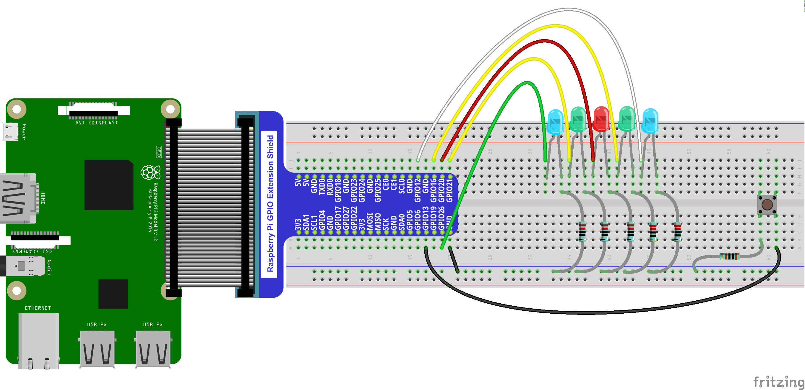

# Silly and fun LED-chaser game using a Raspberry pi

How to play:
- the LEDs scan back and forth like night-rider
- you must hit the button when the red LED is illuminated to score points
- if you miss, you lose a life
- the LEDs scan faster after each button press, a truly devious challenge!
- when you run out of lives, it shows your score in binary
- it then waits for you to press the button, and then starts over

Python source code is located in src.

fritzing layout documents are located in fritzing_docs.
